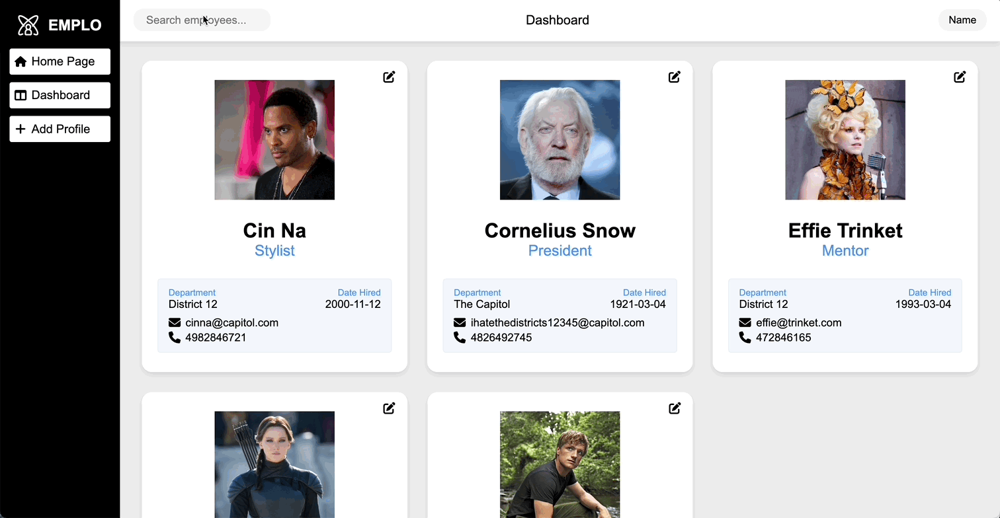

# Employee Creator/Manager

## Demo



## Planning 

In this project, I will be focussing on: 
- ensuring my Components are resuable and that they do not handle data/logic themselves (this should be handled by the parent Containers).
- Using eNums for states that determine rendering.
- Extensive error handling for the forms.
- Implementing React Redux instead of the useContext Hook.
- Extensive error handling on the back-end.
- Testing on both sides.
- Logical relationships between tables/columns in mySQL

## Planning 

In this project, I will be focussing on: 
- ensuring my Components are resuable and that they do not handle data/logic themselves (this should be handled by the parent Containers).
- Using eNums for states that determine rendering.
- Extensive error handling for the forms.
- Implementing React Redux instead of the useContext Hook.
- Extensive error handling on the back-end.
- Testing on both sides.
- Logical relationships between tables/columns in mySQL

## MVP / Recommendations

A web application to create, list, modify and delete employees. The application should consist of a spring RESTful API and a React Typescript frontend. The schema for the employee is left to the criteria of the candidate.

## Hosting

(Netlify & Azure): https://superlative-cocada-2236c6.netlify.app ** APP IS NO LONGER LIVE DUE TO BUDGETARY ISSUES, PLEASE REFER TO THE DEMO. APOLOGIES **

## Features
* Home Page
* Dashboard - includes Employee Component display alongside sorting options. When clicked the Employees display more info
* Edit Employee Form - available on every employee Component. Pre fills the Employee info and displays the Edit persion of the Form Component
* Add Employee Form - available through the vertical navbar. Contains custom data inputs.
* Both Forms - custom zod error handling 

## Future Changes
- Currently, the Home Page does not have any function
- It will be updated soon to allow for authentication
- Depending on the account, the user will/wont be able to access the Employee Info Modal

## Change Log

### 10th April
- set up front-end and back-end files
- imported the dependencies: Spring Web, Validation I/O, Spring Testing, Spring Data JPA, MySQL Driver, Spring Devtools.

### 11th April
- Fleshed out front-end: basic form of all components complete, except the form which is almost done (routes added)
- Added the Employee entity including its eNums to the back-end
```java
@Entity
@Table(name = "employees")
public class Employee {
...
	public enum ContractType {
		PERMANENT,
		CONTRACT
	}
	
	public enum WorkType {
		FULL_TIME,
		PART_TIME
	}
```
### 12th April
- iniialised the files for front and back end - made all components and classes
- finished off the planning

### 14th April
- finished out hooking up react-hook-form with my project - ready to be integrated with back-end
- UseForm and SubmitHandler are the what I needed to use
```js
 const {
    handleSubmit,
    register,
    reset,
    formState: { errors },
  } = useForm<Employee>({
    resolver: zodResolver(schema),
  });
```
```js
const submitHandler: SubmitHandler<Employee> = (data) => {
    onSubmit(data, id);
  };
...
  return (
<form
        className={styles.form__page}
        onSubmit={handleSubmit(submitHandler)}
      >
)
```

### 20th April
- Completed the Service, Controller & UpdateEmployeDTO classes.
- Completed the error handling package by adding NotFoundException, ServiceValidationException, GlobalExceptionHandler
- fleshed out CSS and banner component
- title updates depending on which route/page

### 23rd April
- Added zod error handling
- this required extra handling for number inputs

### 31st April
- Added sort and search bar functionality to the dashboard
- Their state containing the updated Employee List needed to be handled together to get them to work syncronously 
- also added in Home Page tab which will be used later down the track for authentication

### 2nd May
- finally fixed the issues I was having containerising my Back-end & Database
- successfully containerised the back-end (server and database)

```yml
version: "3.8"

services:
  app:
    build:
      context: ./employee.creator.back_end
      dockerfile: Dockerfile
    ports:
      - "3000:8080"
    depends_on:
      db:
        condition: service_healthy
    environment:
      SPRING_DATASOURCE_URL: jdbc:mysql://db:3306/${DB_NAME}
      SPRING_DATASOURCE_USERNAME: ${DB_USER}
      SPRING_DATASOURCE_PASSWORD: ${DB_PASSWORD}
    volumes:
      - ./employee.creator.back_end/src:/app/src
      - ./employee.creator.back_end/pom.xml:/app/pom.xml
    healthcheck:
      test:
        [
          "CMD-SHELL",
          "curl --fail http://localhost:8080/actuator/health || exit 1",
        ]
      interval: 10s
      timeout: 10s
      retries: 5

  db:
    image: mysql:latest
    platform: linux/amd64/v8
    environment:
      MYSQL_DATABASE: ${DB_NAME}
      MYSQL_ROOT_PASSWORD: ${ROOT_PASSWORD}
    ports:
      - "3307:3306"
    volumes:
      - ./database/init.sql:/docker-entrypoint-initdb.d/init.sql
      - ./database/mysql-data:/var/lib/mysql
    healthcheck:
      test: ["CMD", "mysqladmin", "ping", "-h", "localhost"]
      timeout: 20s
      retries: 10

volumes:
  mysql-data:
```
- this was how I got my yml to work
- interestingly it still worked when I had the incorrect config for the app volumes but I have since updated the file and container

### 13th June
* Hosted using Azure
- I needed to add @AllArgsConstructor and @NoArgsConstructor to the EmployeeEntity

### 6th September
* Planning adding in E2E and Service Unit Testing to the backend

### 8th September
* Added in Back-end Testing
* Added GitHub Action
